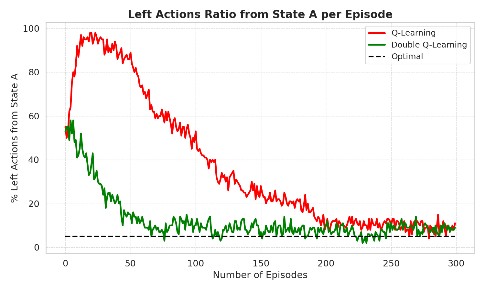

# DQN

This repository demonstrates and compares Q-Learning and Double Q-Learning algorithms in a custom environment. The project includes:

- Implementation of Q-Learning and Double Q-Learning agents
- A simple environment for agent interaction
- Visualization of the percentage of left actions taken from state A over episodes
- Example usage and plotting in `main.py`

The code generates a plot (`left_actions_ratio_a1.png`) to illustrate the learning behavior and performance of both algorithms.

## Example Output

Below is an example plot generated by the code:

